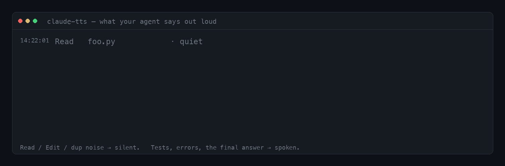

# claude-tts

[](https://github.com/chendrizzy/claude-tts/actions/workflows/test.yml)
[](LICENSE)
[](pyproject.toml)
[](#no-llm-fallback)

**Hear your coding agent.** claude-tts speaks a *curated, filtered* stream of a
[Claude Code](https://docs.anthropic.com/en/docs/claude-code) agent's work — the
status pivots, the errors, the final answers — and stays quiet through the noise.
A local LLM judges what's worth saying and summarizes the long bits; a TTS engine
synthesizes it; Claude Code hooks drive the whole thing. Local-first and
token-free by default.

<p align="center">
  
</p>

> ▶ **[Watch the ~14s clip with sound](docs/media/demo.mp4)** · **[audio only](docs/media/sample.mp3)** — the exact lines marked SPEAK above, voiced by the default `edge-tts` engine.

The frame above isn't a mockup: it's `tests/fixtures/event_corpus.jsonl` replayed
through the real classifier (`scripts/demo_gif.py`). The same corpus gates CI, so
the demo can't drift from what the daemon actually does.

## What it says — and what it doesn't

The value isn't the voice, it's the *judgment*. Default verdict is **silence**;
only four kinds of event earn speech.

| A Claude Code event… | Verdict | …becomes |
|----------------------|---------|----------|
| `Read`/`Edit`/`Write` succeeds | 🔇 quiet | — |
| `git status`, a file listing, fenced code, a repeat | 🔇 quiet | — |
| `pytest` → `23 passed, 4 failed in 12.3s` | 🔊 **status** | *"In the tests: 23 passed, 4 failed."* |
| a command writes to stderr | 🔊 **error** *(pre-empts)* | *"cat: /nonexistent: No such file or directory"* |
| "★ Insight: the timeout fires before the handshake…" | 🔊 **insight** | *(spoken; long ones summarized)* |
| the assistant's end-of-turn answer | 🔊 **final answer** | *"Done. The bug was a missing await on the queue.put call."* |

And it cleans markup *before* it speaks, so you never hear punctuation read out:

| In the agent's raw output | Spoken |
|---------------------------|--------|
| `` Run `pytest -q` now `` | Run pytest -q now |
| `Fixed the **race** in` `queue_manager.py` | Fixed the race in queue_manager.py |
| `the value 2**8 equals 256` | the value 2\*\*8 equals 256 *(math kept, not "bold")* |
| `checked out agent-a1b2c3d4e5 worktree` | checked out worktree *(hash dropped)* |
| `## Summary` · `[the docs](https://…)` | Summary · the docs |

> Replaying 6,695 real spoken excerpts through the normalizer, markdown leaked
> into speech in **23.8%** of them before this cleaner and **0.0%** after — a
> figure asserted on every run by `make verify` (`tests/test_shadow_replay.py`).

## How it works

```
Claude Code hooks ──▶ unix socket ──▶ daemon
                                        │
        ContentRouter (classify · judge · summarize)   ← the filter brain
                                        │
        QueueManager ▶ Orchestrator ▶ Generate ▶ Playback
                          (LLM provider seam)  (TTS engine)  (OS audio)
```

The filter brain decides **what** to surface and **how** to phrase it. Synthesis
and playback are swappable behind three seams. The assistant's end-of-turn answer
is classified as **prose**, so ordinary markdown in it (a symbol run, a
diff-stat- or commit-shaped line) doesn't trip the stdout-noise patterns that gate
raw tool output and would otherwise veto the whole summary; whole-message shapes,
dedup, and `system-reminder` blocks still drop. For the full picture — the
classification ladder, backpressure tiers, error pre-emption, the markdown→speech
chokepoint — see **[docs/ARCHITECTURE.md](docs/ARCHITECTURE.md)**.

- **LLM provider seam** (`daemon/providers/`) — `judge(text) → speak?` and
  `summarize(text) → str`. Ships `ollama` (local default), `openai_compat`
  (any OpenAI-compatible `base_url`: LM Studio, llama.cpp, vLLM, Groq, …), and
  `null` (a deterministic, no-LLM floor — see below).
- **TTS engine seam** (`daemon/engines/`, `daemon/pipeline/`) — `edge-tts`
  (cross-platform Azure voices), `say`/`espeak` (zero-dependency system engine),
  `kokoro` (local MLX, Apple Silicon), and `voicebox` (local app via REST).
- **Platform seam** (`daemon/platforms/`) — macOS `afplay` + `launchd`; Linux
  auto-detected player + `systemd --user`; Windows `ffplay` (run daemon manually).

### No-LLM fallback

With `llm_provider.type = "null"`, the system still works on deterministic rules:
it speaks structured signals (test counts, errors, status) and drops noise,
summarizing by truncation. The LLM is an *intelligence upgrade*, not a hard
dependency.

## Install

claude-tts is a Claude Code plugin. Once it's added as a marketplace source:

```
/plugin marketplace add chendrizzy/claude-tts
/tts:setup
```

`/tts:setup` detects your platform, picks an engine and LLM backend, calibrates
the backend against a bundled mini-eval, installs the background service
(`launchd` / `systemd --user`), and writes your config. Re-runnable and
idempotent; `/tts:doctor` re-checks health anytime.

<details>
<summary><b>Manual setup</b> (development, or running without the plugin)</summary>

```bash
git clone https://github.com/chendrizzy/claude-tts
cd claude-tts
uv sync --extra edge          # base deps + the edge-tts engine
cp config.example.json ~/.config/claude-tts/config.json   # edit to taste
```

Wire the hooks in `hooks/` into your Claude Code settings (the registry is
`hooks/hooks.json`); the `SessionStart` hook launches the daemon automatically.
Verify it's alive: the daemon binds the socket (see
[Configuration](#configuration)) and a test utterance plays. The **kokoro**
engine additionally needs an `mlx-audio` interpreter pointed to by `$MLX_PYTHON`
(see [`.env.example`](.env.example)).
</details>

## Commands

| Command | What it does |
|---------|--------------|
| `/tts:setup` | First-run setup: engine, LLM backend, calibration, service, config |
| `/tts:status` | Daemon socket, active engine + model, recent log tail (read-only) |
| `/tts:log` | Replay what the daemon has actually spoken — newest first, with timestamps + category (read-only) |
| `/tts:doctor` | Disk, daemon/socket, deps, backend reachability — PASS/WARN + fixes |
| `/tts:voice` | Pick a speech engine and voice, then restart to apply |
| `/tts:uninstall` | Stop and remove the service/daemon (optionally the config) |

## Requirements

- **Python ≥ 3.11** and [`uv`](https://docs.astral.sh/uv/).
- **macOS** (`afplay` + `launchd`) or **Linux** (auto-detected audio player +
  `systemd --user`). On Windows, run the daemon manually or use WSL2/Docker.
- For the default **LLM provider**: a local [Ollama](https://ollama.com) with a
  small model, e.g. `ollama pull qwen2.5-coder:1.5b` — or any OpenAI-compatible
  server, or no LLM at all.
- For an **engine**: `edge-tts` (the `edge` extra, needs internet) or — on
  Apple Silicon — `kokoro` via a separate `mlx-audio` interpreter.

## Configuration

Copy [`config.example.json`](config.example.json) (every key is annotated inline)
and edit. Every block is optional; the daemon embeds safe defaults. Common knobs:
`voice.engine`, `llm_provider.type`, `summarizer.model`,
`filtering.max_response_length`. Full reference, defaults, and environment
variables: **[docs/CONFIGURATION.md](docs/CONFIGURATION.md)**.

## Spoken-output log & statusline

Every utterance the daemon speaks is appended to a bounded, per-session JSONL at
`~/.claude/logs/tts/spoken/<session>.jsonl` (`daemon/spoken_log.py`, capped at the
most recent 500 lines). It's best-effort — a logging failure never silences
speech. **`/tts:log`** prints it newest-first with timestamps and category (pass
a count, or `--session <id>` to target one session).

**Sub-agents and background agents** each get their own `session_id` from Claude
Code, so each writes its own spoken-log file. With
`statusline.include_subagent_in_main` enabled, `/tts:log` (no `--session`) merges
sibling-agent lines that overlap this session's time span, each tagged by source.
Caveat: the merge is purely by time-overlap — spoken-log entries don't yet carry a
cwd/project tag, so an *unrelated* session running concurrently from another
directory can be folded in too. Leave it `false` (the default) if you run multiple
projects at once; cwd-scoped merging is the planned follow-up.

**Statusline 🔊 segment.** The repo ships the spoken-log *data* plus a
`statusline` config block — but **not** the rendering wrapper that draws the 🔊
segment (that's a personal/global statusline file, outside this repo). To compose
your own, read the latest line with `spoken_log.read_latest()` (or tail the
JSONL) and append it to your existing statusline. The config keys (in
[`config.example.json`](config.example.json)) are **view-only** — the daemon
always logs raw per-session truth; they only change what the statusline and
`/tts:log` *show*:

| Key | Default | Effect |
|-----|---------|--------|
| `statusline.subagent_aware` | `true` | **reserved / currently inert.** Intended to let the statusline follow whichever agent spoke most recently, but spoken-log entries carry no cwd tag yet, so following the newest *file* would surface unrelated concurrent sessions. Until cwd-tagging lands, treat the statusline contract as **strictly session-scoped**. |
| `statusline.active_window_s` | `90` | recency window (seconds) for the sub-agent-following above; **no effect while `subagent_aware` is inert**. |
| `statusline.include_subagent_in_main` | `false` | merge sibling-agent lines into `/tts:log`'s default view — **by time-overlap across _all_ sessions** (no cwd scoping yet), so it can pull in unrelated concurrent sessions. |

> **Note (v0.1.4):** sub-agent-*following* on the statusline is deferred until
> spoken-log entries record a cwd/project tag. The shipped behavior is strictly
> session-scoped; `subagent_aware`/`active_window_s` are placeholders for the
> cwd-scoped follow-up and do not pivot the line today.

**Low disk no longer mutes silently.** Before each synthesis write, the daemon
checks free space against a fixed internal threshold (~200 MB, not config-tunable);
below it, it evicts cache and — if still low — refuses to synthesize and fires a
*loud* alert: a desktop notification (`osascript` / `notify-send`) plus a
`disk_full` spoken-log entry that surfaces on the statusline, instead of failing
the write quietly.

## Cursor (editor) support

claude-tts can also speak for [Cursor](https://cursor.com)'s agent. The repo
ships wrapper hooks that translate Cursor's agent-hook events into the same
daemon the Claude Code hooks drive:

| Cursor hook event | Wrapper script |
|-------------------|----------------|
| `preToolUse` | `hooks/cursor-pre-tool-use.sh` |
| `postToolUse` | `hooks/cursor-post-tool-use.sh` |
| `afterAgentResponse` | `hooks/cursor-after-agent-response.sh` |

`hooks/cursor_normalize.py` maps Cursor's field names (`conversation_id` →
`session_id`, `tool_output` → `tool_response`, `Shell` → `Bash`, …) into the
Claude Code hook shape; each wrapper then delegates to the matching Claude Code
hook with `CLAUDE_TTS_PASSTHROUGH=false`, so Cursor's tool stdout stays clean
(that gate in `hooks/pre-tool-use.sh` / `post-tool-use.sh` defaults to `true` for
Claude Code, which chains hooks on stdout).

These wrappers are **not** registered in `hooks/hooks.json` — Cursor wiring is
manual. Point Cursor's hook config at the absolute path of each wrapper, in
`<project>/.cursor/hooks.json` (one project) or `~/.cursor/hooks.json` (all
projects):

```json
{
  "version": 1,
  "hooks": {
    "preToolUse": [{ "command": "/abs/path/to/claude-tts/hooks/cursor-pre-tool-use.sh" }],
    "postToolUse": [{ "command": "/abs/path/to/claude-tts/hooks/cursor-post-tool-use.sh" }],
    "afterAgentResponse": [{ "command": "/abs/path/to/claude-tts/hooks/cursor-after-agent-response.sh" }]
  }
}
```

- **macOS:** the after-response wrapper uses GNU `timeout` — install it with
  `brew install coreutils`.
- **Python:** `PYTHON_BIN` defaults to a macOS framework `python3`; override it
  with `CLAUDE_TTS_PYTHON`, and it falls back to `command -v python3`.

Environment variables read by the wrappers:

| Var | Default | Effect |
|-----|---------|--------|
| `CLAUDE_TTS_ENABLED` | `true` | set to anything else to mute the wrappers |
| `CLAUDE_TTS_PYTHON` | framework `python3` | interpreter used for normalization + dispatch |
| `CLAUDE_TTS_PASSTHROUGH` | `true` (wrappers force `false`) | when `false`, the underlying hook does not echo stdin, keeping Cursor's tool stdout clean |

## Project layout

```
daemon/              the daemon — socket server, router, async pipeline, seams
  content_router.py    the filter brain: classify → judge → summarize
  pipeline/            ingest → process → generate → playback
  providers/           LLM seam: ollama · openai_compat · null
  engines/             TTS seam: edge-tts · system (say/espeak)
  platforms/           OS seam: launchd · systemd · audio players
  spoken_log.py        bounded per-session JSONL of what was actually spoken
hooks/               Claude Code hook scripts + hooks.json registry (+ cursor-* wrappers)
commands/            slash commands (/tts:setup, status, doctor, voice, log, uninstall)
skills/tts-setup/    the first-run setup procedure
scripts/             calibration, manifest sync, the demo generators
tests/               the `make verify` gate + fixtures (spoken & event corpora)
docs/                ARCHITECTURE · CONFIGURATION · PUBLISH
```

## Development

`make verify` is the **binding quality gate** — a deterministic, all-sync suite
(no live daemon, Ollama, or `pytest-asyncio` needed) that fails on markdown
leaking to speech, classification regressions, and path-humanization bugs.

```bash
uv sync --extra edge --extra dev
uv run make verify
```

CI runs that same gate across macOS + Linux × Python 3.11–3.13; a separate,
informational `async-suite` job (`continue-on-error`, Linux + Python 3.12)
additionally exercises the async pipeline/playback/queue tests under
`pytest-asyncio` so async regressions stay visible.

See [CONTRIBUTING.md](CONTRIBUTING.md) for the test layout and how to add a
provider or engine, and [docs/PUBLISH.md](docs/PUBLISH.md) for the release
process. The demo media is regenerated with
`uv run --with pillow python scripts/demo_gif.py` (and `demo_audio.py`).

## License

[MIT](LICENSE) © chendrizzy
